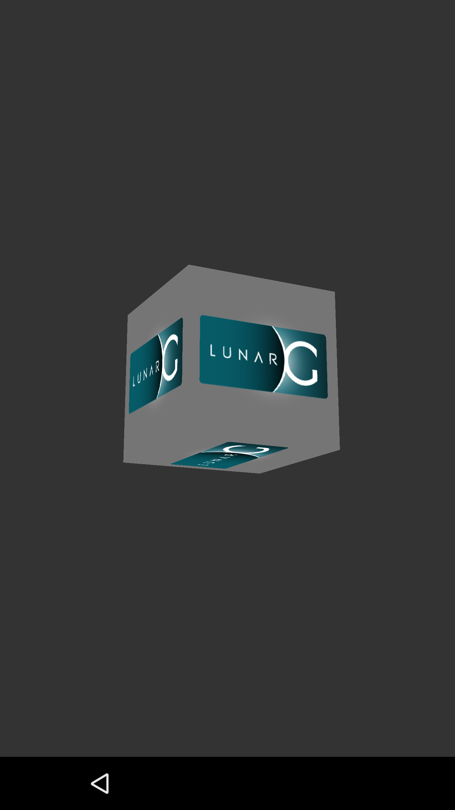

# Vulkan Samples
This repository is an Android port of [LunarG sample kit](https://github.com/LunarG/VulkanSamples).

## Prerequisites
- Android Studio 2.2.2 or later.
- Android SDK N-preview or later
- NDK r12 beta or later

## Sample import
To import the samples, follow steps below:

####Step 1: (Optional) Build shaderc in NDK. This step is optional for API_samples as Android Studio project automatically execute it.
In a command-prompt navigate to “${ndk_root}/sources/third_party/shaderc”
Run the following command

~~~
../../../ndk-build NDK_PROJECT_PATH=. APP_BUILD_SCRIPT=Android.mk APP_STL:=c++_static APP_ABI=[armeabi-v7a|arm64-v8a|x86|x86_64|all] libshaderc_combined -j16
~~~

APP_STL can be one of gnustl_static, gnustl_shared, c++_static, c++_shared.
Here, it’s going to use statically linked version of libC++ as samples are using it.

####Step 2: Sync external project and generate files.
In a command-prompt navigate to “LunarGSamples", run the following commands
~~~
./update_external_sources.sh -s -g
~~~
This process is required to build Hologram sample.

####Step 3: (Optional) Build Android Studio project file. This step is optional as the repository includes a pregenerated project files that includes All ABIs.
~~~
cmake -DANDROID=ON -DANDROID_ABI=[armeabi-v7a|arm64-v8a|x86|x86_64|all(default)]
~~~

####Step 4: Import the samples in Android Studio by choosing “Import project (Eclipse, ADT, Gradle)” and choose: LunarGSamples/API-Samples/android/build.gradle
Note:  the project include 40+ subjects, takes some time to load, specially for Windows OS

Meta data for Android Studio sample import.
-------------------------------------------

==================
Vulkan API samples
==================

Demonstrates basic usages of Vulkan APIs.

Introduction
------------
The project includes series of samples demonstrating a basic usage of Vulkan APIs.
This repository is an Android port of [LunarG sample kit](https://github.com/LunarG/VulkanSamples).

Getting Started
---------------
Refer [Getting Started Guide](http://developer.android.com/ndk/guides/graphics/getting-started.html).

Screenshots
-----------

Support
-------

- Google+ Community: https://plus.google.com/communities/<...>
- Stack Overflow: http://stackoverflow.com/questions/tagged/<...>

If you've found an error in this sample, please file an issue:
https://github.com/googlesamples/<...>/issues

Patches are encouraged, and may be submitted by forking this project and
submitting a pull request through GitHub.

License
-------

Copyright 2016 Google, Inc.

Licensed to the Apache Software Foundation (ASF) under one or more contributor
license agreements.  See the NOTICE file distributed with this work for
additional information regarding copyright ownership.  The ASF licenses this
file to you under the Apache License, Version 2.0 (the "License"); you may not
use this file except in compliance with the License.  You may obtain a copy of
the License at

http://www.apache.org/licenses/LICENSE-2.0

Unless required by applicable law or agreed to in writing, software
distributed under the License is distributed on an "AS IS" BASIS, WITHOUT
WARRANTIES OR CONDITIONS OF ANY KIND, either express or implied.  See the
License for the specific language governing permissions and limitations under
the License.
